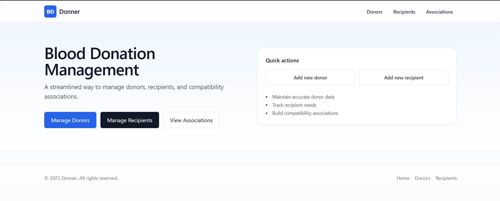
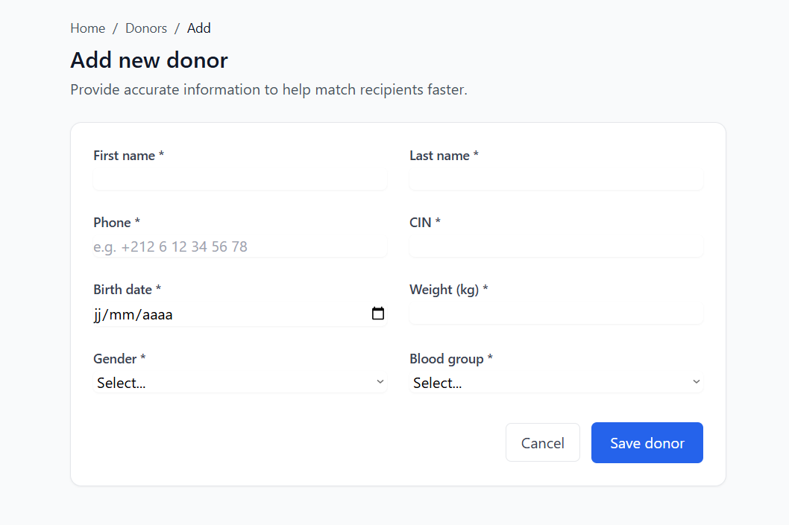
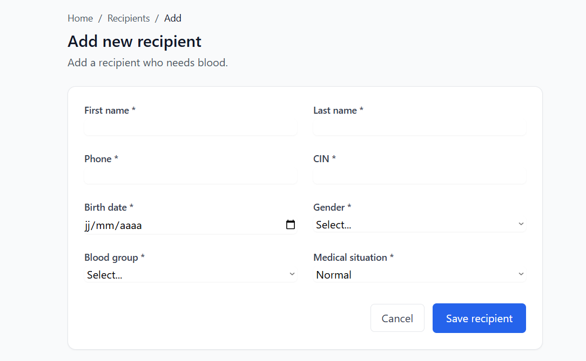

# Simple Blood Donation System

A very simple blood donation management system for beginners learning Java.

## What this system does:
- Add and manage blood donors
- Add and manage blood recipients  
- Create simple associations between donors and recipients

## Technologies used:
- **Java 8** (simple, no advanced features)
- **JSP** (basic web pages)
- **PostgreSQL** (simple database)
- **JDBC** (basic database connection)
- **Maven** (to manage dependencies)

## How to run:

### 1. Setup Database
1. Install PostgreSQL on your computer
2. Open PostgreSQL and run the `database_setup.sql` file
3. This will create the database and tables

### 2. Update Database Connection
1. Open `src/main/java/com/donner/util/DatabaseConnection.java`
2. Change the password to your PostgreSQL password:
   ```java
   private static final String PASSWORD = "your_password_here";
   ```

### 3. Build and Run
1. Open terminal/command prompt
2. Go to the project folder
3. Run: `mvn clean package`
4. Copy the `target/Donner.war` file to your Tomcat webapps folder
5. Start Tomcat
6. Open browser and go to: `http://localhost:8080/Donner`

## Project Structure (Simple):
```
src/
├── main/
│   ├── java/com/donner/
│   │   ├── controller/     # Servlets (handle web requests)
│   │   ├── service/        # Business logic (simple classes)
│   │   ├── dao/           # Database operations (JDBC)
│   │   ├── model/         # Data classes (POJOs)
│   │   └── util/          # Database connection
│   └── webapp/
│       ├── WEB-INF/
│       │   ├── views/     # JSP pages (web pages)
│       │   └── web.xml    # Configuration
│       └── index.jsp      # Home page
```

## How it works (Simple explanation):

1. **Model classes** - Just simple Java classes to hold data
2. **DAO classes** - Use JDBC to save/load data from database
3. **Service classes** - Simple business logic (validation, etc.)
4. **Controller classes** - Handle web requests (GET/POST)
5. **JSP pages** - Show data in web browser

## Database Tables:
- `donneurs` - stores donor information
- `receveurs` - stores recipient information  
- `associations` - links donors to recipients

## Features:
- Add new donors
- Add new recipients
- View lists of donors and recipients
- Create associations between compatible donors and recipients
- Simple validation (weight must be at least 50kg)


## Troubleshooting:
- Make sure PostgreSQL is running
- Check database password in DatabaseConnection.java
- Make sure Tomcat is running
- Check console for error messages

## Screenshots:
- Home page :

- Add Donor page :

- Add recipient page :
- 